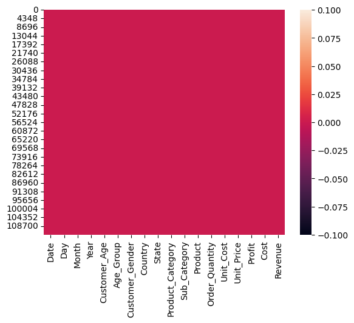
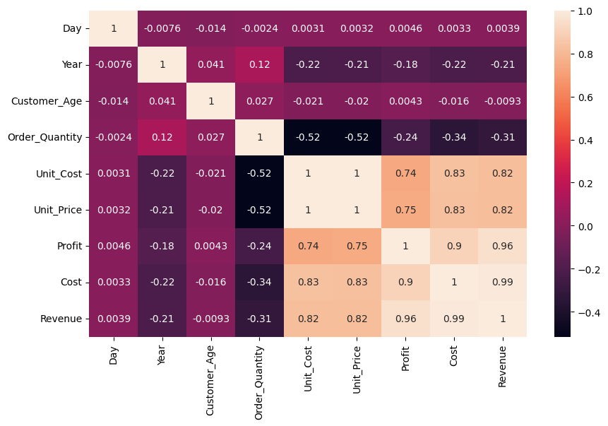
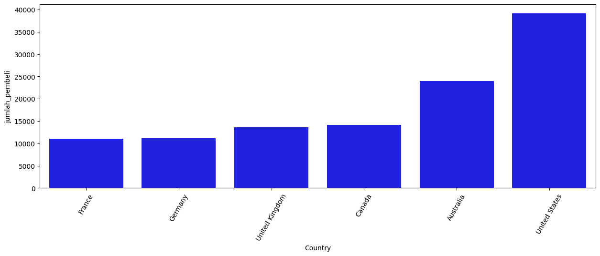
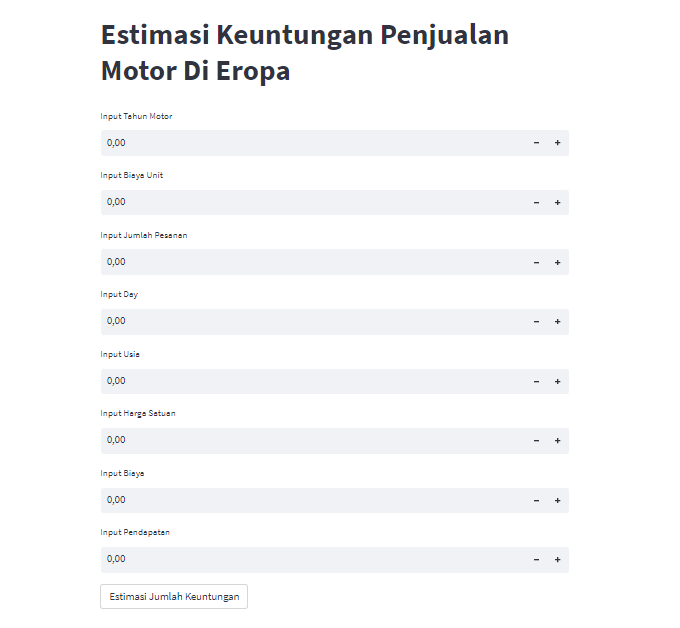

# Laporan Proyek Machine Learning
### Nama : Salsabila Aulia Putri 
### Nim : 21135116
### Kelas : Malam A

## Domain Proyek
Proyek ini bertujuan untuk menganalisis data keuntungan penjualan dari toko sepeda motor di Eropa. Data ini mencakup informasi penjualan sepeda motor, pelanggan, produk, dan karyawan toko sepeda selama beberapa tahun. Analisis ini bertujuan untuk memahami tren penjualan, profil pelanggan, performa produk, serta kinerja karyawan.

## Business Understanding
Pada tahap membutuhkan pengetahuan dari objek bisnis, bagaimana membangun atau mendapatkan data, dan bagaimana untuk mencocokan tujuan pemodelan untuk tujuan bisnis sehingga model terbaik dapat dibangun. Banyaknya penduduk menengah keatas di Eropa menyebabkan bisnis ini mendapat Keuntungan yang lebih banyak dibanding di benua Eropa. Tujuan dari analisis ini untuk mengetahui estimasi Keuntungan penjualan motor di Eropa.

### Problem Statements
Meskipun kita memiliki akses ke data penjualan toko sepeda motor di Eropa selama beberapa tahun, masih ada sejumlah pertanyaan dan masalah yang perlu kita selesaikan untuk memahami kinerja toko dan meningkatkan profitabilitasnya. 

 ### Goals
  mencari solusi untuk memudahkan Perusahaan-Perusahaan untuk melihat keuntungan penjualan motor di eropa

  ### Solution statements
  - Strategi Pemasaran, Dengan memahami tren penjualan dan preferensi pelanggan, kita dapat merancang strategi pemasaran yang    lebih efektif. Ini dapat mencakup penargetan iklan online ke segmen pelanggan tertentu, peluncuran kampanye promosi produk tertentu, atau penggunaan strategi harga yang lebih bijak.
  - Segmentasi Pelanggan, Dengan memahami preferensi pelanggan, kita dapat melakukan segmentasi pelanggan berdasarkan faktor-faktor seperti jenis sepeda yang mereka pilih, lokasi, atau frekuensi pembelian. Hal ini memungkinkan kita untuk merancang strategi pemasaran yang lebih tepat sasaran untuk setiap kelompok pelanggan.
  - Model yang dihasilkan dari datasets itu menggunakan metode Linear Regression.

  ## Data Understanding
  Tahap ini memberikan fondasi analitik untuk sebuah penelitian dengan membuat ringkasaan (summary) dan mengidentifikasi potensi masalah dalam data. Dari data yang telah diambil mengenai Keuntungan penjualan motor di Eropa, terdapat 18 kolom yang berisi 9 kolom objek dan 9 kolom int64. Disini saya menggunakan Regresi Linier dan Data yang dapat diolah

  https://www.kaggle.com/datasets/prepinstaprime/europe-bike-store-sales

  ### Variabel-variabel pada Europe bike store sales adalah sebagai berikut:    
    1. date (tanggal) = objek
    2. day (hari) = int64
    3. month (bulan) = objek
    4. year (tahun) = int64
    5. customer age (umur pembeli) = int64
    6. age group (kelompok umur) = objek
    7. customer gender (jenis kelamin pembeli) = objek
    8. country (negara) = objek
    9. State (negara) = objek
    10. Product Category (Kategori Produk) = objek
    11. Sub Category (Kategori cadangan) = objek
    12. Product (Produk) = objek
    13. Order Quantity (Jumlah Pesanan) = int64
    14. Unit Cost (Biaya Satuan) = int64
    15. Unit Price (Harga Satuan) = int64
    16. Profit (Keuntungan) = int64
    17. Cost (harga) = int64
    18. Revenue (pendapatan) = int64

## Data Preparation
### Data Collection
Data ini adalah sumber pengetahuan berharga tentang pasar sepeda di Eropa, memberikan wawasan tentang perilaku pelanggan, preferensi produk, dan kinerja toko.

### Data Discovery And Profiling
Pertama tama kita harus mengimport library-library yang dibutuhkan 
``` bash
import pandas as pd
import numpy as np
import matplotlib.pypot as plt
import seaborn as sns
```
lanjut dengan memasukan dataset dan untuk melihat 5 data di urutan paling atas
```bash
df = pd.read_csv('Sales.csv')
df.head()
```
melihat type data yang digunakan
``` bash
df.info()
```
untuk melihat data yang kosong menggunakan map dan bisa dilihat dari gambar dibawah ini
``` bash
sns.heatmap(df.isnull())
```
 <br>
Aman

untuk mendeskripsikan datasets
```bash
df.describe()
```

untuk meng explorasi data kita bisa dilihat dari gambar dibawah ini
``` bash
plt.figure(figsize=(10,6))
sns.heatmap(df.corr(), annot=True)
```


untuk mencari jumlah pembeli berdasarkan negara
```bash
brands = df.groupby('Country').count()[['Unit_Price']].sort_values(by='Unit_Price', ascending=True).reset_index()
brands = brands.rename(columns={'Unit_Price':'jumlah_pembeli'})
```
```bash
fig = plt.figure(figsize=(15,5))
sns.barplot(x=brands['Country'], y=brands['jumlah_pembeli'], color='blue')
plt.xticks(rotation=60)
```
hasil : (array([0, 1, 2, 3, 4, 5]),
 [Text(0, 0, 'France'),
  Text(1, 0, 'Germany'),
  Text(2, 0, 'United Kingdom'),
  Text(3, 0, 'Canada'),
  Text(4, 0, 'Australia'),
  Text(5, 0, 'United States')])
  

  ## Modeling
  langkah ini diawali dengan seleksi fitur
```bash
fitur = ['Year', 'Unit_Cost', 'Order_Quantity','Day','Customer_Age','Unit_Price','Cost','Revenue']
x = df[fitur]
y = df['Profit']
x.shape, y.shape
```
((113036, 8), (113036,))

lanjut langkah ini men split data testing dan data training
```bash
from sklearn.model_selection import train_test_split
x_train, X_test, y_train, y_test = train_test_split(x,y,random_state=70)
y_test.shape
```
hasilnya : (28259,)

selanjutnya membuat regresi linier
```bash
from sklearn.linear_model import LinearRegression
lr = LinearRegression()
lr.fit(x_train,y_train)
predik = lr.predict(X_test)
```
## Evaluasi
untuk mengevaluasi data 
```bash
nilai = lr.score(X_test, y_test)
print('Akurasi Model Regresi Linier : ', nilai)
```
Akurasi Model Regresi Linier :  1.0
Akurasi model regresi linier yang bernilai 1.0 menunjukkan bahwa model ini sempurna cocok dengan data pengujian.

membuat inputan regresi linier
```bash
inputan = np.array([[2014, 45, 22, 31, 87, 70, 108, 63]])
prediksi = lr.predict(inputan)
print('Estimasi Keuntungan Penjualan Motor : ', prediksi)
```

## Deployment

  [App](https://pembelajaranmesin-ccrhqvzeekzehrv87f9arv.streamlit.app/)

  
